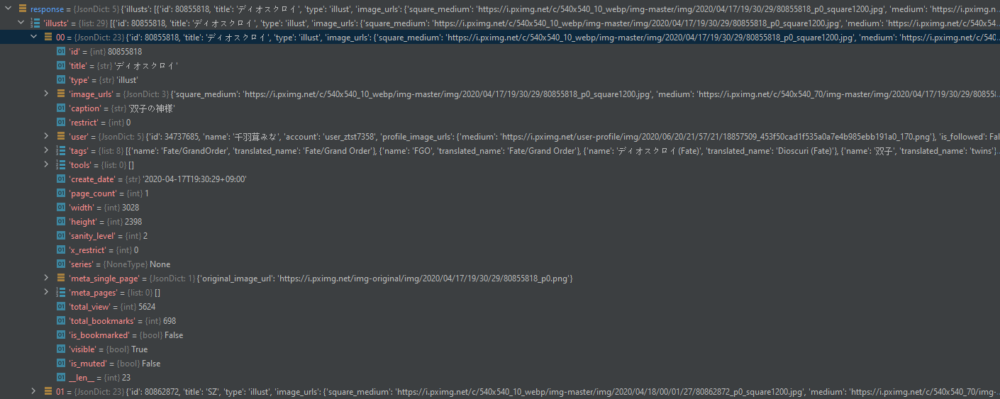
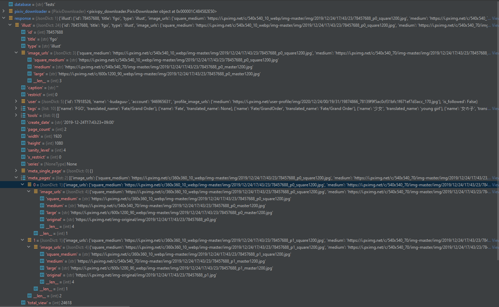

# Pixiv

Contains all code that the `pixiv_cog` and the `image_fetcher` utilize. 3 Parts:

1. `pixiv_db_initializer` creates the pixiv database
2. `pixiv_db` maintains the pixiv database
3. `pixiv_downloader` downloads images and adds them to the database

## Request examples

### Illustration

### Multiimage illustration

## Resources

### offset.json

Pixiv images are requested with a certain offset. So as example if there are 1.000 images with the tag "ice cream", then
an offset of 0 would return the first 30 images and an offset of 60 would return images 60-90.

Offsets are tracked per tag and reseted once they reach the limit, which is 5.000.

## Tests

### Database tests

First run the `pixiv_db_initializer`. It will create two database folders, one called `Main` and one called `Tests`.

Then you can just run the tests.