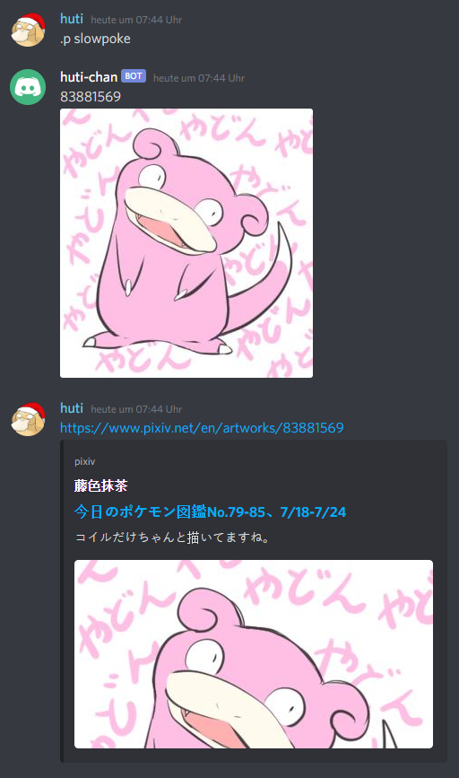

# Discordbot - Pixiv

Currently, this Discordbot is able to download Pixiv images to a database and upload them when requested to do so. For
detailed information check the [docs](./Docs/README.md).

## Building

### Prerequisites

Config information has to be inserted before running the bot.

Fill the fields inside `./Bot/config.ini`

### Building with Docker

Intended way of Development & Deployment.

Download the repository

```bash
git clone https://github.com/huti26/discordbot
cd discordbot
```

Start the Bot and rebuild the image if necessary.

```bash
docker-compose up --build
```

## FAQ

### Why download and upload the pictures instead of posting the pixiv post link and letting discord embed it?

When I first started researching this, I found out that this would not be possible, but during development I noticed,
that this information was outdated. I decided to finish developing it anyways, since it is mainly for educational
purposes.

Aditionally, while embeding pixiv post links is possible, embeding the actual image link is not. So the output of this
bot is a bit cleaner as it can be seen here



## Dependencies

[Link](https://github.com/huti26/discordbot/network/dependencies)

## License

Use this codebase however you may please
